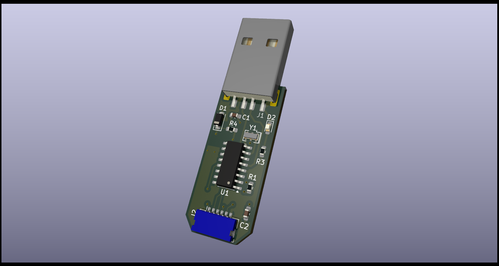

# ESP-PROG Stick

This project implements a compact and portable tool for programming ESP8266 modules, using ESP-Prog in a USB stick form factor. The design features a detachable cable for ease of use and transport, allowing for quick and efficient programming of ESP8266 modules.

## Features

- **Compact USB Stick Format:** The tool is designed to be portable, fitting easily into a USB port.
- **Detachable Cable:** Comes with a detachable cable for easy connection and disconnection, making it more versatile and durable.
- **ESP-Prog Functionality:** Enables seamless programming and debugging of ESP8266 modules, using the widely supported ESP-Prog standard.

## Hardware Details

- **Design Software**: Created using **KiCad 8.0.6**.
- **Components**: The device consists of a USB stick PCB form factor for ESP-Prog functionalities and a detachable cable to connect directly to ESP8266 modules for programming and debugging.

## License

This project is licensed under the GPL v3 License.

## Contributing

Feel free to submit issues or contribute to this project. Fork the repository and make a pull request with detailed information about your changes.

## Acknowledgments

- [Espressif Systems](https://www.espressif.com/) for ESP-Prog and ESP8266 documentation.
- Community resources on ESP8266 programming and USB hardware designs.
